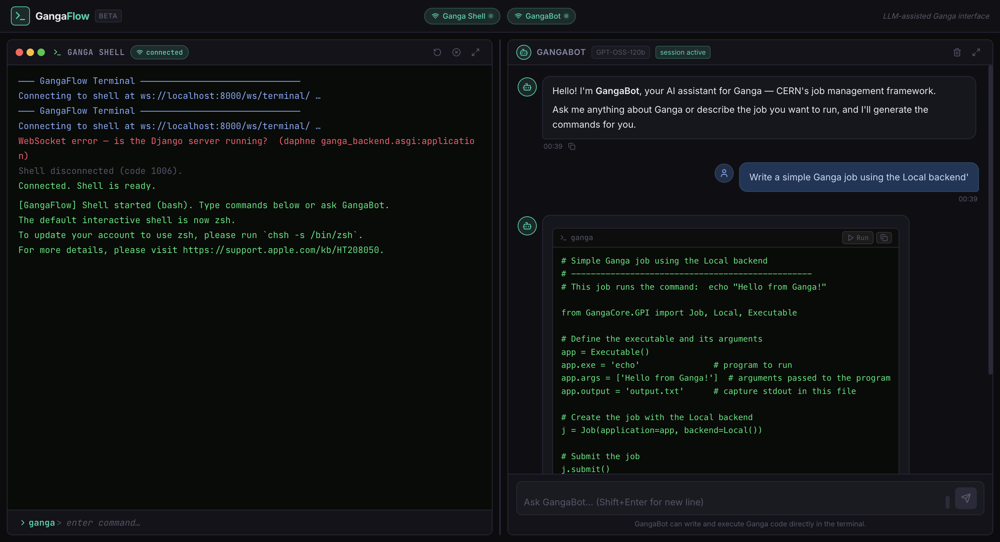

# GangaFlow (Ongoing 🚧)

**Your AI-powered gateway to mastering Ganga effortlessly.**

GangaFlow combines the power of LLMs with a Django + Channels backend and a React frontend to provide an intuitive, split-pane interface for [Ganga](https://ganga.readthedocs.io/en/latest/) — CERN's job management framework. No more command memorisation — talk to GangaBot and get the job done.

---

## What is GangaFlow?

GangaFlow is a GUI + LLM assistant that:
- Translates natural-language instructions into Ganga Python commands.
- Runs those commands live in a real PTY shell streamed over WebSocket.
- Maintains full chat memory and persists sessions to a local SQLite database.
- Keeps the Ganga shell and GangaBot chat side-by-side in a single browser tab.

---

## Interface

| Left pane | Right pane |
|-----------|------------|
| **Ganga Shell** — real PTY terminal over WebSocket | **GangaBot** — LLM chat with Markdown rendering |



---

## Tech Stack

| Layer | Technology |
|-------|------------|
| Frontend | React 18, Vite 5, react-markdown, lucide-react |
| Backend | Django 5.1, Django Channels 4, Daphne (ASGI) |
| Static files | WhiteNoise — serves built React app from Django |
| Terminal | ptyprocess — real PTY shell over WebSocket |
| LLM | Blablador API · `GPT-OSS-120b` (Helmholtz) |
| DB | SQLite — `ChatSession` + `ChatMessage` models |

---

## Prerequisites

- **Python 3.12** (other 3.10+ versions likely work)
- **Node.js 18+** and npm
- A **Blablador API key** from [Helmholtz AAI](https://login.helmholtz.de/)

---

## Installation

### 1. Clone

```bash
git clone https://github.com/your-username/ganga-flow.git
cd ganga-flow
```

### 2. Python environment

```bash
python3 -m venv .venv
source .venv/bin/activate      # Windows: .venv\Scripts\activate
pip install -r requirements.txt
```

### 3. Environment variables

Create a `.env` file in the project root (never commit this):

```dotenv
BLABLADOR_API_KEY=your_key_here
GANGABOT_MODEL=1 - GPT-OSS-120b - an open model released by OpenAI in August 2025
GANGABOT_SYSTEM_PROMPT=You are GangaBot, an expert assistant for the Ganga job management framework used at CERN. Help users write, submit, and debug Ganga jobs. Always provide working Python code examples.

# Optional: auto-launch Ganga instead of plain bash in the terminal pane
# GANGAFLOW_SHELL=/path/to/.venv/bin/ganga
```

### 4. Database migrations

```bash
python manage.py migrate
```

### 5. Build the frontend

```bash
cd frontend && npm install && npm run build && cd ..
```

> The built files land in `frontend/dist/` and are served directly by Django via WhiteNoise — no separate Node process is needed at runtime.

---

## Running

### Option A — Double-click launcher (macOS, recommended)

Double-click **`GangaFlow.command`** in Finder.

It will automatically:
1. Kill any existing process on port 8000
2. Build the latest React frontend
3. Start the Django/Daphne backend
4. Open `http://localhost:8000` in your browser

Press **Ctrl+C** in the Terminal window that opens to stop everything.

> First time only: macOS may block the script. Go to **System Settings → Privacy & Security → Allow Anyway**, then double-click again.

### Option B — Manual (two commands)

**Terminal 1 — Backend (port 8000)**

```bash
source .venv/bin/activate
.venv/bin/daphne -p 8000 ganga_backend.asgi:application
```

**Browser** — open `http://localhost:8000`

To pick up frontend code changes, rebuild first:

```bash
cd frontend && npm run build
```

> The **Ganga Shell** and **GangaBot** status pills in the navbar turn green once the backend is reachable.

---

## Project Structure

```
ganga-flow/
├── assistant/
│   ├── llm/
│   │   ├── client.py        # Blablador HTTP wrapper
│   │   └── chat.py          # GangaBot class (stateful, history-aware)
│   ├── consumers.py         # PTY WebSocket consumer
│   ├── models.py            # ChatSession + ChatMessage
│   ├── views.py             # /api/chat/ endpoints
│   └── routing.py           # ws/terminal/ URL
├── frontend/
│   ├── src/components/
│   │   ├── Navbar.jsx        # Live status pills
│   ├── │   Terminal.jsx      # PTY shell pane
│   │   └── Chat.jsx          # GangaBot chat pane
│   └── dist/               # Built output served by WhiteNoise (git-ignored)
├── ganga_backend/
│   ├── asgi.py              # ProtocolTypeRouter (HTTP + WS)
│   ├── settings.py
│   └── urls.py
├── GangaFlow.command        # macOS double-click launcher
├── requirements.txt
└── .env                     # (create yourself, never commit)
```

---

## API Endpoints

| Method | URL | Description |
|--------|-----|-------------|
| `POST` | `/api/chat/` | Send a message; returns `{ reply, session_id }` |
| `GET`  | `/api/chat/<session_id>/history/` | Fetch full message history for a session |

---

## Future Plans

- Ganga job graph visualiser
- Fine-tuned local LLM option
- Multi-user login with role-based access
- Deployment to CERN cloud

---

## Contributing

Pull requests, feature suggestions, and bug reports are welcome!  
See [CONTRIBUTING.md](./CONTRIBUTING.md) for guidelines.

---

Made with ❤️ by Soumya Shaw