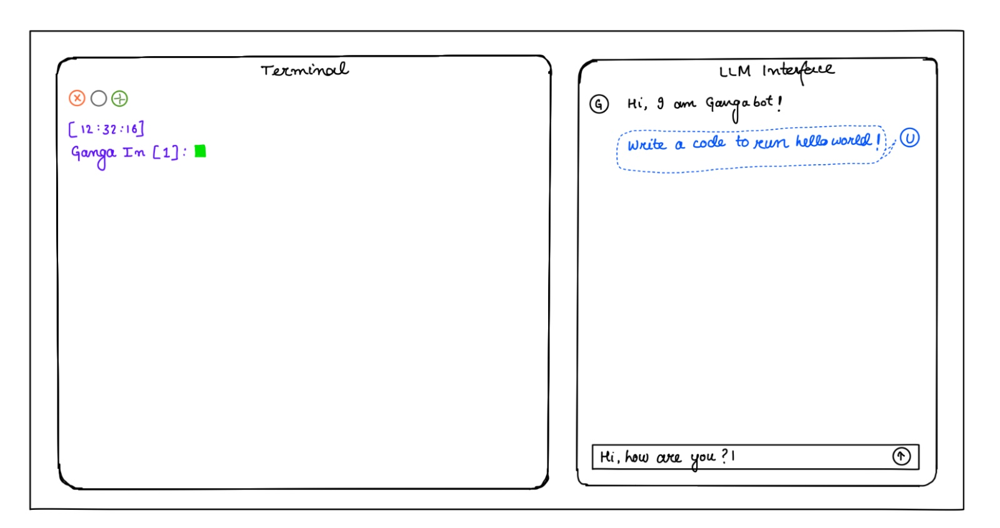

# GangaFlow (Ongoing 🚧)

**Your AI-powered gateway to mastering Ganga effortlessly.**

GangaFlow combines the power of LLMs with a smart Django-based backend and a React frontend to provide an intuitive experience for running jobs via [Ganga](https://ganga.readthedocs.io/en/latest/), CERN’s job management system. No more command memorization—just talk to Gangabot and get the job done!

---

## What is GangaFlow?

GangaFlow is a GUI + LLM assistant that:
- Translates user instructions into Ganga commands.
- Runs commands directly in a Ganga shell using a Django-managed backend.
- Displays a terminal emulator and chat interface.
- Maintains environment context like `projectpath`, job IDs, etc.
- Supports memory-based interaction over longer sessions.

---

## Features

- 💬 **Conversational LLM agent (GangaFlow)**
- 🖥️ **Embedded Ganga shell terminal view**
- 🔁 **Continuous chat memory & variable tracking**
- ⚙️ **Django backend managing LLM and job execution**
- 📜 **Fine-tuned LLM for Ganga command generation**
- 🚀 **React-based frontend for fluid UX**

---

## Interface Overview

- **Left Pane**: Terminal running Ganga shell commands  
- **Right Pane**: Chat interface powered by the LLM  


---

## Installation

### 1. Clone the Repo

```bash
git clone https://github.com/your-username/ganga-flow.git
cd ganga-flow
```

### 2. Backend Setup (Django)

```bash
conda create --name ganga-env python=3.10
conda activate ganga-env
pip install -r requirements.txt

python manage.py migrate
python manage.py runserver
```

### 3. Frontend Setup (React + Vite)

```bash
cd frontend
npm install
npm run dev
```

The dev server starts at **http://localhost:3000** (or the next available port if 3000 is in use — check the terminal output).

To build for production:

```bash
npm run build
```

> **Note:** The frontend proxies `/api` and `/ws` requests to `http://localhost:8000` (Django). Start the Django backend first for full functionality.

---

## Documentation

- [Architecture](./docs/architecture.md)
- [Usage Guide](./docs/usage_guide.md)
- [Fine-tuning Notes](./docs/finetuning_notes.md)

---

## Examples

Example scripts and JSON configs:
- `examples/run_hello_world.yaml`
- `examples/complex_job_submission.json`

---

## Tech Stack

- **Frontend**: React 18, Vite, lucide-react (CSS variables, no Tailwind)  
- **Backend**: Django (Python)  
- **Shell Integration**: Subprocess, Ganga APIs  
- **LLM**: Fine-tuned LLM model  

---

## Future Plans

- Streamlined onboarding flow for new users  
- Ganga job graph visualizer  
- Persistent memory storage across sessions  
- Multi-user login with role-based access  
- Deployment to CERN cloud  

---

## Contributing

Pull requests, feature suggestions, and bug reports are welcome!  
See [CONTRIBUTING.md](./CONTRIBUTING.md) for guidelines.

---

Made with ❤️ by Soumya Shaw
